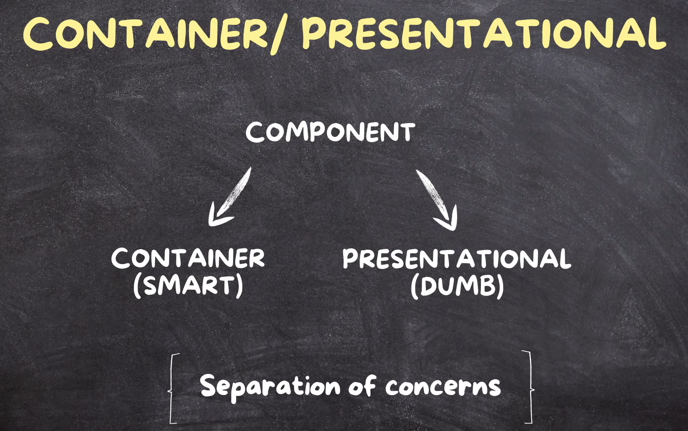
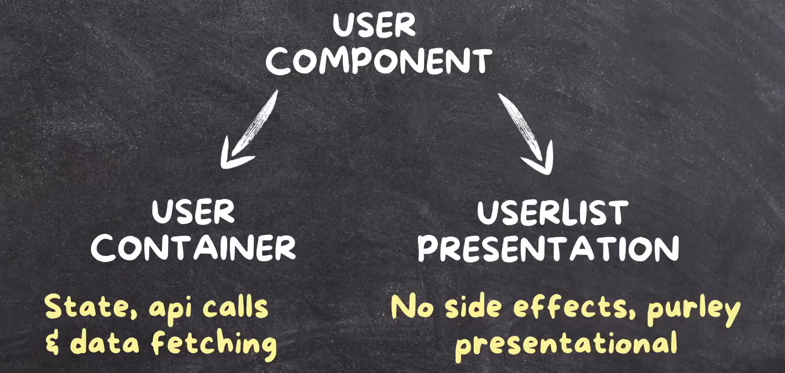

# React Design Patterns

A short guide to common design patterns used in React, converted from Logseq-style notes to standard Markdown while preserving all original content.

## Index
- Container / Presentational
- Custom Hooks
- Higher Order Components (HOC)
- Render Props
- Provider / Context
- Compound Component
- Project Folder Structure

---

Refer to [Refactoring in React](./Refactoring%20in%20React.md)
Refer OOP General [OOP Design Patterns](./OOP%20Design%20Patterns.md)

## Design Pattern Used in React

### 1. Container/Presentational Component Pattern



Single component is divided into two parts: 1. Container (component with logic) & 2. Presentational (pure UI component).

For an example:



Pros

- Separation of concerns (enhanced maintainability and easier to understand and maintain)
- Improved reusability: UI components become reusable since they are not bound to specific state or actions
- Simplified testing: presentational components are easier to test since they are stateless

Cons

- Increased boilerplate (more files and structure)
- Overhead for small/simple components (may feel like over-engineering)
- Learning curve

### 2. Custom Hooks Pattern

This pattern separates logic from pure UI components.

Pros

- Code reusability
- Consistency
- Separation of concerns
- Improved readability

Cons

- Risk of over-abstraction
- Potential performance issues if implemented incorrectly (extra re-renders)

Rules / Flow

Refer [Refactoring in React](./Refactoring%20in%20React.md)

- Each time you use a custom hook in a different component, it creates an isolated instance with its own state. Always keep in mind:
  - Clean up in `useEffect`
  - Wrap action functions with `useCallback()` when needed

File extension guidance

- Use `.ts` for hooks that don't return JSX.
- Use `.tsx` for hooks that return JSX or render components internally.

Export style

- Named export (recommended): `export function useCounter() {}`
- Default export: `export default function useCounter() {}`

Example:

```javascript
export function useUserProfile(userId) {
  // Implementation
}

export function useUserPreferences(userId) {
  // Implementation
}

export function useUserNotifications(userId) {
  // Implementation
}

// Import like:
// import { useUserProfile, useUserPreferences } from './userHooks';
```

### 3. Higher Order Component (HOC) Pattern


Pros

- Enhance UI components by reusing existing code

Cons

- Wrapper hell (nested wrappers can be hard to manage)
- Debugging complexity

When to use HOC

- Use HOC when you want to reuse pure UI components
- Prefer custom hooks for logic reuse instead of HOCs when possible

Example

```javascript
// HOC 
const withLog = (Component) => {
  return ({ className }) => {
    console.warn('rendered');

    return <Component className={className} />;
  };
};

// App.tsx
function App() {
  const CompWithLog = withLog(Container);
  return <CompWithLog />;
}

// Container.tsx
export default function Container() {
  return (
    <div className="m-2">
      <h1> container </h1>
    </div>
  );
}

export default App;
```

### 4. Render Props Pattern

Render props allow sharing logic between components using a function as a prop.

```javascript
// Reusable logic: data fetching
function DataFetcher({ url, render }) {
  const [data, setData] = React.useState(null);
  const [loading, setLoading] = React.useState(true);

  React.useEffect(() => {
    fetch(url)
      .then((res) => res.json())
      .then((data) => {
        setData(data);
        setLoading(false);
      });
  }, [url]);

  if (loading) return <p>Loading...</p>;
  if (!data) return <p>Error fetching data.</p>;

  return render(data); // Render prop used here
}

// Usage: Displaying user data
function UserProfile({ userId }) {
  return (
    <DataFetcher
      url={`https://jsonplaceholder.typicode.com/users/${userId}`}
      render={(user) => (
        <div>
          <h2>{user.name}</h2>
          <p>Email: {user.email}</p>
        </div>
      )}
    />
  );
}

// Usage: Displaying post data
function Post({ postId }) {
  return (
    <DataFetcher
      url={`https://jsonplaceholder.typicode.com/posts/${postId}`}
      render={(post) => (
        <div>
          <h3>{post.title}</h3>
          <p>{post.body}</p>
        </div>
      )}
    />
  );
}
```

Notes

- Passing functions as props is a common way to share behavior. Custom hooks are an alternative for many cases.

Video reference: https://youtu.be/pNaW0Md2o0g?si=W4xx4x6n3tY2w2qT&t=281

### 5. Provider/Context Design Pattern

To avoid prop drilling we use this pattern (Context API).

### 6. Compound Component Pattern

When to use

- Watch the first 1–2 minutes of this video to understand the problem: https://www.youtube.com/watch?v=PPOKvugfi98

When reusing a component requires passing many small boolean props to control which child to show, consider the compound component pattern.

Example

```javascript
<ProductCard>
  <ProductCard.Title>Apple</ProductCard.Title>
  <ProductCard.Image src={img}></ProductCard.Image>
  <ProductCard.Price>$45.25</ProductCard.Price>
</ProductCard>
```

How to implement: https://www.youtube.com/watch?v=WmI2qQYtNSo

### 7. Project Folder structure

As you evolve and scale your project, adjust folder structure when needed. Useful articles:
- https://dev.to/itswillt/folder-structures-in-react-projects-3dp8
- https://profy.dev/article/react-folder-structure

General Advice: At the end, separate things into three parts: `Feature Component`, `Page Component`, and `Pure UI Component`.
