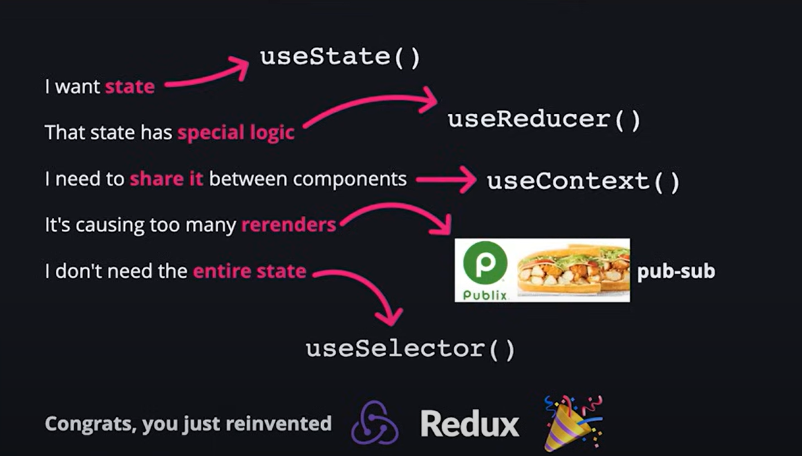

# ReactJS Notes

A collection of short notes and tips about React behavior, state updates, context, and common pitfalls.

## Index
- State updates and references
- useContext default value
- Examples

---

## Note
React uses **shallow comparison** to detect changes in state. When you mutate (change) the state array (`data`) directly (using `splice`, or assignment operator to the state variable), you're changing the contents of the array but not its reference. Since the reference stays the same, React doesn't detect a change, and therefore, **it will not trigger a re-render**.

```javascript
const [data, setData] = useState(2);

// if you set value directly using assignment operator
// data = 23; // this will give an error when using const

// Important point: even if it allowed changing the value directly,
// it wouldn't trigger a re-render because the reference didn't change.
```

In React, when you call `setState`, the component re-rendering process depends on whether React detects a change between the previous state value and the new state value.

## This comparison is done differently depending on the type of data:

- For primitive values (strings, numbers, booleans):
  - React compares by value
  - If `newState !== prevState`, a re-render is triggered

- For objects and arrays (reference types):
  - React performs a shallow comparison (comparing references, not contents)
  - Even if two objects have identical content, if they're different object instances (different references), React will trigger a re-render
  - This is why directly mutating state objects without creating new references won't trigger re-renders

## When `defaultValue` used with useContext Hooks

In JavaScript, "fallback" typically refers to a **secondary mechanism or value used when a primary feature or functionality isn't available**.

Example:

```javascript
let userName = user.name || "Guest"; // Guest is fallback value
```

```javascript
document.body.style.fontFamily = "'CustomFont', Arial, sans-serif";
// if 'CustomFont' is unavailable, the browser will use Arial, and if that's unavailable,
// it will use a generic sans-serif font.
```

When you create a context with `createContext(defaultValue)`, that defaultValue serves as a fallback. It's only used when a component tries to consume the context (using `useContext`) but can't find a matching Provider component above it in the component tree.

Example 1: With Matching Provider

```javascript
// Create a context with default value "light"
const ThemeContext = React.createContext("light");

function App() {
  return (
    // The Provider supplies "dark" as the context value
    <ThemeContext.Provider value="dark">
      <Button /> {/* This Button will receive "dark" */}
    </ThemeContext.Provider>
  );
}

function Button() {
  // This will receive "dark" from the Provider above
  const theme = useContext(ThemeContext);
  return <button className={theme}>Click me</button>;
}
```

Example 2: Without Provider

```javascript
// Create a context with default value "light"
const ThemeContext = React.createContext("light");

function App() {
  return (
    // No Provider here!
    <div>
      <Button /> {/* This Button will receive "light" (the default) */}
    </div>
  );
}

function Button() {
  // No Provider above, so this gets the default value "light"
  const theme = useContext(ThemeContext);
  return <button className={theme}>Click me</button>;
}
```

Think of the default value as a safety net - it's what components fall back to if they can't find a Provider. This is particularly useful:

