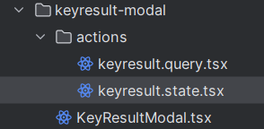

# Refactoring in React

Notes and recommendations for refactoring React code, state management, and component design.

## Index
- Recommended videos
- State management (Zustand)
- useReducer
- Modal state patterns
- Custom hooks

---

Highly recommend to watch this: `Topic: 13 & 14`
Video: [Watch on YouTube](https://www.youtube.com/watch?v=5r25Y9Vg2P4)

## For state management: Zustand

- Instead of using Context API for every component we need to wrap that specific component using provider.
- It is better to use Zustand library especially when you want to manage state separately from UI.
- See, if you want to follow this kind of flow/structure then Zustand is a better choice



`feature`: `KeyResultModal.tsx` is a feature component that contains UI and uses these `actions/` files to call actions from UI.

`actions/` file contains two main files:

- `.query.tsx` for all DB related abstracted functions which can also use `.state.tsx` because once DB action done to sync that data with state it also use state action function.
- `.state.tsx` contains all state and their actions

Note: I followed this structure because I wanted to separate state and all state-action from UI part (`KeyResultModal.tsx`).

## When to use `useReducer`

- When **state is complex**:
  - When state contains multiple sub-values or nested objects
  - OR When there are many state variables in a single component that are dependent on each other
- Use `useReducer` when multiple state updates need to happen together or when state change involves complex logic like filtering, calculation, etc.
- When you want to optimize performance by avoiding unnecessary re-renders or calculations.
- When you want to manage global or shared state across components.

Remember: `useReducer` is effective in refactoring or following design patterns to abstract out state and multiple state-operations from client-component files.

## Don’t use `useReducer`

- When you have simple and independent pieces of state that can be managed with `useState`. For example, a single counter or toggle.

## How modal and their state should be managed

Generally, we require two main things:

- `button` to open modal
- `modal` to show it in popup

Due to this file structure we always keep state in parent not inside modal component itself. For example:

```javascript
// Parent.jsx
export default function Parent(){
  const [isOpenModal, setIsOpenModal] = useState(false);

  return (
    <>
      <button onClick={() => setIsOpenModal(true)}> OPEN MODAL </button>

      {isOpenModal && <Modal setIsOpenModal={setIsOpenModal} />}
    </>
  )
}


// Modal.jsx
export default function Modal({setIsOpenModal}){
  return (
    <div>
      <h1> ... </h1>
      <button onClick={() => setIsOpenModal(false)}> close </button>
    </div>
  )
}
```

Now here you might worry about `Parent.jsx` component where we have to check state and then render and in fact we have to keep state here in `Parent.jsx`.

So, how about if we move state to Modal and do something like the following:

```javascript
// Parent.jsx
export default function Parent(){
  return (
    <Modal /> // Put this Modal Where you want to place/show Open-Modal button in this component.
  )
}


// Modal.jsx
export default function Modal(){
  const [isOpenModal, setIsOpenModal] = useState(false);

  return (
    <>
      <button onClick={() => setIsOpenModal(true)}> OPEN MODAL </button>

      {isOpenModal && 
        <div className="...blur background z-20 ...">
            <h1> ... </h1>
            <button onClick={() => setIsOpenModal(false)}> close </button>
        </div>
      }
    </>
  )
}
```

Advantages:

- State will stay in their context/component itself.
- Cleaner, easier to understand and maintain.

## When to use custom hooks?

Custom hooks help you to reduce code complexity. Suppose you have two different web pages called Login and Registration. Both of these pages will have input fields and a password toggle feature. Instead of writing the same code twice, create a custom hook for password toggling.

## Important things to keep in mind while creating custom hooks

- Each time you use a custom hook in a different component, it creates a completely isolated instance with its own state.

Example:

```javascript
// Our custom hook
function useCounter() {
  const [count, setCount] = useState(0);
  
  const increment = () => setCount(count + 1);
  
  return { count, increment };
}

// Component A using the hook
function ComponentA() {
  const { count, increment } = useCounter();
  return (
    <div>
      <p>Component A count: {count}</p>
      <button onClick={increment}>Increment A</button>
    </div>
  );
}

// Component B using the same hook
function ComponentB() {
  const { count, increment } = useCounter();
  return (
    <div>
      <p>Component B count: {count}</p>
      <button onClick={increment}>Increment B</button>
    </div>
  );
}
```

**Independent Instances**: When ComponentA calls `useCounter()`, it gets its own `count` state. When ComponentB calls the same hook, it gets a completely separate `count` state.

**No Sharing**: Clicking "Increment A" only affects ComponentA's count. Clicking "Increment B" only affects ComponentB's count.

<!-- Logseq properties preserved below -->
<!--
Original Logseq metadata (preserved):
logseq.order-list-type:: number
-->
